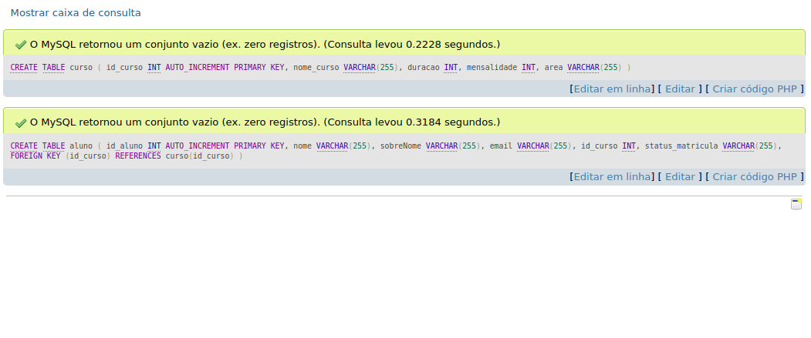
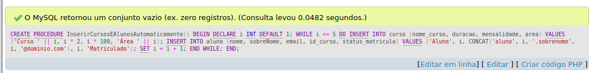
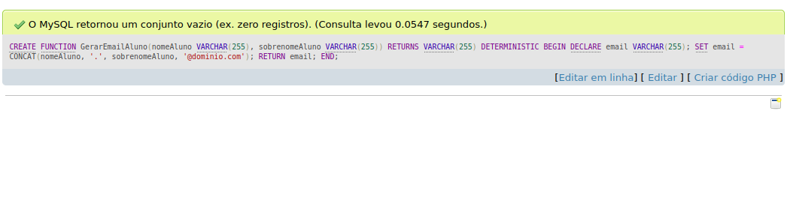
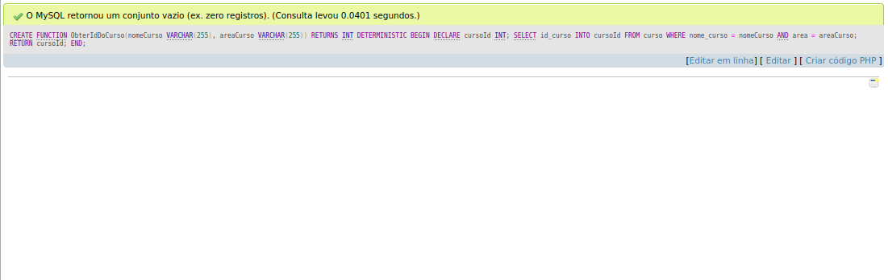
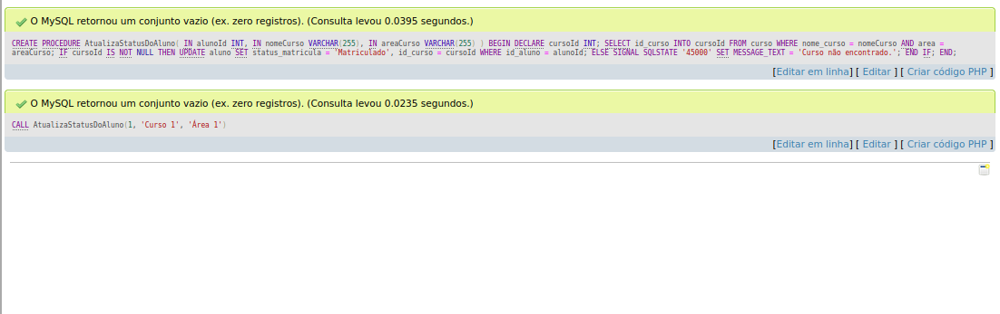
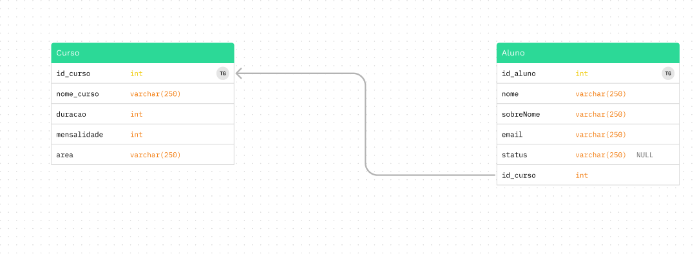

# Atividade individual AF - SQL 

Orientador: Daniel Oatha

<h1>--------  ---------------</h1>

[Link Para Verificar o SQL](https://github.com/Leon14789/SistemaUniversidade/blob/master/sql)

Crie um banco de dados para armazenar alunos e cursos de uma universidade;

<h1>--------  ---------------</h1>

Utilize Stored Procedures para automatizar a inserção e seleção dos cursos;

<h1>--------  ---------------</h1>
O aluno possui um e-mail que deve ter seu endereço gerado automaticamente no seguinte formato: nome.sobrenome@dominio.com

<h1>--------  ---------------</h1>

Crie uma função que recebe o nome de um curso e sua área, em seguida retorna o id do curso;

<h1>--------  ---------------</h1>

Crie uma procedure que recebe os dados do aluno e de um curso e faz sua matrícula;

<h1>--------  ---------------</h1>
Crie o modelo lógico do exercício.

